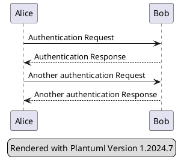
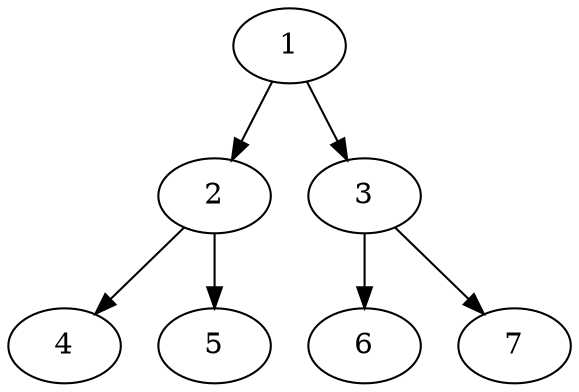

::: details Table of Contents
[toc]
:::

---

# markdown-it-emoji

Technically you can just insert the unicode symbol directly into the post. The plugin allows you to use text shortcuts such as `:)` and `:+1:`.

- **Emoticons:** :) :(
- **Emojis:** :joy: :+1:

# markdown-it-external-links

External link: [Link to google](https://www.google.com)

# markdown-it-container

::: warning
This is a warning
:::

::: success
Success message
:::

::: info
For your information
:::

::: danger STOP
This is dangerous!
:::

::: details click me
This is a paragraph

```js
function hello() {
  console.log("Hello!");
}
```
:::

# markdown-it-footnote

## Normal footnote

Here is a footnote reference,[^1] and another.[^longnote]

[^1]: Here is the footnote.

[^longnote]: Here's one with multiple blocks.

    Subsequent paragraphs are indented to show that they
belong to the previous footnote.

## Inline footnote

Here is an inline note.^[Inlines notes are easier to write, since
you don't have to pick an identifier and move down to type the
note.]


# markdown-it-katex

Inline formula $\sqrt{3x-1}+(1+x)^2$

Block formula

$$\begin{array}{c}

\nabla \times \vec{\mathbf{B}} -\, \frac1c\, \frac{\partial\vec{\mathbf{E}}}{\partial t} &
= \frac{4\pi}{c}\vec{\mathbf{j}}    \nabla \cdot \vec{\mathbf{E}} & = 4 \pi \rho \\

\nabla \times \vec{\mathbf{E}}\, +\, \frac1c\, \frac{\partial\vec{\mathbf{B}}}{\partial t} & = \vec{\mathbf{0}} \\

\nabla \cdot \vec{\mathbf{B}} & = 0

\end{array}$$

# markdown-it-grouped-code-fence

```js [ex1-javascript]
function hello() {
  console.log("Hello!")
}
```

```python [ex1-python3]
def hello:
  print("Hello!")
```

Here's another group

```ruby [ex2-ruby]
def hello
  put "Hello!"
end
```

```java [ex2-java]
public static void hello() {
  System.out.println("Hello!");
}
```

# markdown-it-charts

```chart
{
  "type": "pie",
  "data": {
    "labels": [
      "Red",
      "Blue",
      "Yellow"
    ],
    "datasets": [
      {
        "data": [
          300,
          50,
          100
        ],
        "backgroundColor": [
          "#FF6384",
          "#36A2EB",
          "#FFCE56"
        ],
        "hoverBackgroundColor": [
          "#FF6384",
          "#36A2EB",
          "#FFCE56"
        ]
      }
    ]
  },
  "options": {}
}
```

# markdown-it-plantuml-ex

This plugin only processes code blocks with "plantuml" language. The diagram is pre-generated offline using plantuml.jar



# markdown-it-textual-uml

_Note: for PlantUML diagrams, markdown-it-plantuml-ex takes precedence_

## Mermaid diagram


## Dot diagram

This is actually a plantuml diagram rendered by the online plantuml server. Because it specifies the language as "dot", it is processed by mrkdown-it-textual-uml.


